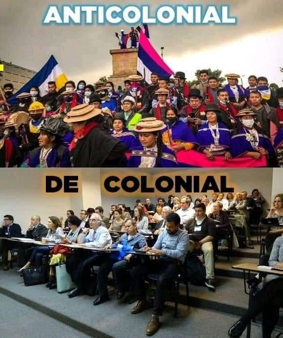

# Mi contribución

En _The Invention of the Americas_ –una serie de conferencias dictadas en Frankfurt en 1992 y después publicadas en 1994 en español y en 1995 en inglés– Enrique Dussel introduce una perspectiva fundamental para un resposicionamiento de la América luso-hispana en la historia mundial. Apoyado en una zona del marxismo que el filósofo llama “un Marx desconocido”[^1], Dussel propone una inversión categórica: América no es una consecuencia de Europa sino Europa la consecuencia de América [@lundBarbarianTheorizingLimits2001 58]. Y por los mismos motivos, América no solo _no_ está fuera ni después de la modernidad capitalista, sino que fue la génesis y condición de posibilidad de esta.  Pero al mismo tiempo, en esta contribución se afirma una condición de exterioridad (). Y es a partir de dicha exterioridad que se construye un horizonte emancipador, afirmado en la certeza identitaria de un lugar de enunciación fijo e inmanentemente diferenciable del capitalismo global [^2]. 

Lo que resulta más problemático de este lugar de enunciación es que está estructuralmente reñido con los roles de poder cultural y privilegio disciplinario que encarna la gran mayoría de sujetos que lo detentan –y _no_ los sujetos en nombre de quien se enuncia. En el contexto de las discusiones surgidas alrededor del Paro Nacional contra la Reforma Tributaria en Colombia en 2021 esta contradicción se expresa como una diferencia entre lo decolonial y lo anticolonial(). Un meme  lo caricaturiza con un contraste jerárquico. Hay un arriba “anticolonial”, donde un grupo de manifestantes del pueblo Misak está congregado de pie, a cielo abierto, alrededor del pedestal vacío de la estatua derribada del conquistador Sebastián de Benalcázar. Y hay un abajo “decolonial”, donde está un grupo de personas sentadas en pupitres en un salón de conferencias de alfombrado gris –entre quienes parece reconocerse al intelectual portugués Boaventura de Sousa Santos. 

https://www.facebook.com/photo?fbid=10157784745956793&set=a.414245736792

Aunque por supuesto mucho menos simple que el meme, la discusión sobre la necesidad de un nuevo giro del pre-fijo no parece expresar algo distinto la discusión de la década antepasada sobre de-coloniality as a “_programmatic_ (…) de-linking” in opposition to post-coloniality: una dicotomía entre el movimiento perpetuo del decisionismo no-occidental, y el estancamiento de la especulación intelectual profesionalizada [@mignoloDELINKINGRhetoricModernity2007 452-453]. Y aunque originada en un lugar menos próximo al  que el de Mignolo a , nada garantiza que al cabo de un tiempo el hipotético giro anticolonial vuelva a estabilizarse como un sentido asimilado a los centros de producción del saber. Más que el envejecimiento y reificación de una tentativa político-intelectual emancipadora, this eternal re-turn –lo que Alberto @moreirasLineaSombraNo2006 llama “descolonización infinita”– parece expresar un problema inherente a las tentativas emancipadoras ancladas al anhelo de exceder lo occidental. En palabras de Joshua @lundBarbarianTheorizingLimits2001:  “the strategic essentialism that often arises from such attempts at revindication elides the basic fact that the intellectuals that we claim as representative of their societies' contributions to theories of culture are typically representative of the only sector of their society that could ever dream of such contribution: the most Westernized sector” (78).

Con mi aproximación hacia el proyecto supranacional de la POD propongo un movimiento crítico que no persigue una mayor exterioridad sino adentrarse en esa contradicción interna. Es una contradicción que ha evitado la teoría de/post-colonial latinoamericana[^3], y que usualmente cuando es advertida por los críticos del giro decolonial es para acusarlo de no ser suficientemente exterior[^4]. Propongo que, salvando las distancias históricas, la contradicción de la teoría afirmada en su no-occidentalidad no parece muy distinta a la de la “especie media” que postulaba Bolívar en 1818: “mas nosotros, que apenas conservamos vestigios de lo que en otro tiempo fue, y que por otra parte no somos indios ni europeos, sino una especie media entre los legítimos propietarios del país y los usurpadores españoles” (). Lo “propio” latinoamericano, cuando no es una (auto)imposición, se sigue manifestando como una tensión entre diferencias no-sintetizables: lo que Antonio @cornejo-polarHeterogeneidadNoDialectica1996 llama “heterogeneidad no dialéctica”. Es en el lugar no-dialéctico del colombismo en el que me propongo indagar, concentrándome en la materialidad de sus objetos impresos, y en las contradicciones y tensiones raciales y geopolíticas que en ellos se expresan. Como inmigrante bolivariano universitario, _white passing_, en los Estados Unidos, no creo que mi lugar sea propicio para dar recetas emancipatorias sino para examinar contradicciones.

[^1]: Dussel, Un Marx desconocido. Marx, El Capital; Manifiesto Comunista; Cuaderno XIV; Cuaderno Kovaleski. Mencionar a Moore como una perspectiva más reciente.

[^2]: Por ejemplo, en en la noción de "epistemologías del Sur" que desarrolla Boaventura @sousasantosEpistemologia2019, o en un sentido más amplio, en nociones como las de Tercer Mundo, los oprimidos o el Sur Global.
[^3]: En una summa de la teoría colonial de los años 90 y 200 como _Coloniality at Large_ no hay ninguna entrada  en el Índice para Francisco de Miranda ni para Simón Rodríguez, y las siete que hay para Simón Bolívar y las tres que hay para Andrés Bello
[^4]: 